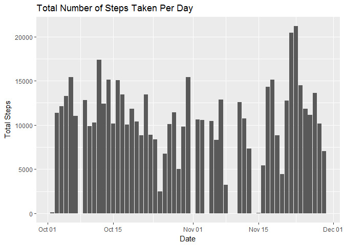
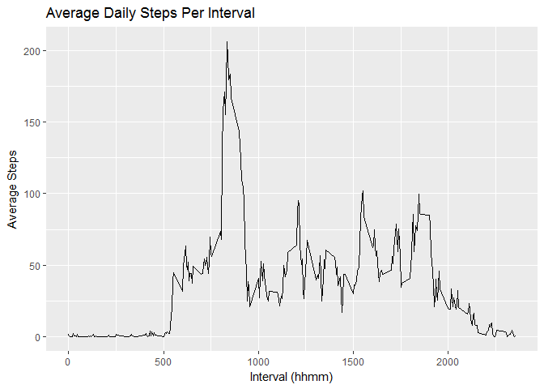
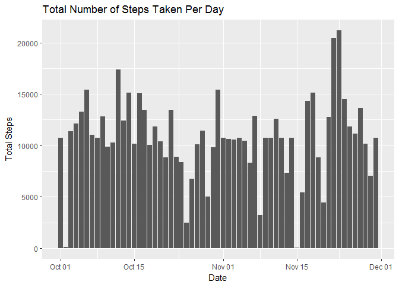
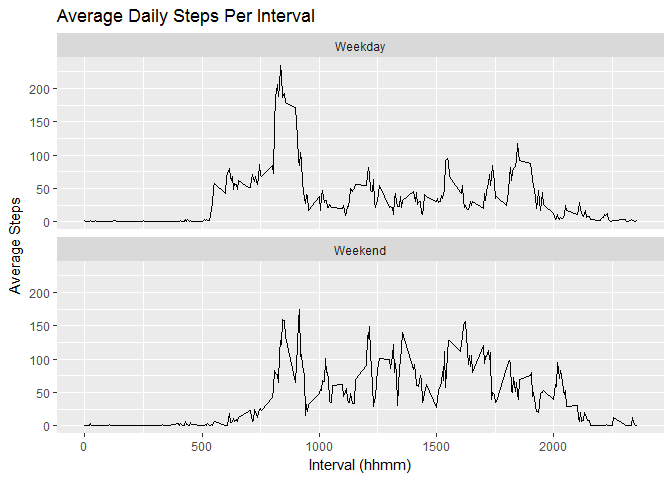

# Reproducible Research: Peer Assessment 1
### Ken Koch

*The following packages were used in the compiling of this data*

```r
library(reshape2)
library(dplyr)
library(ggplot2)
```
##   Loading and preprocessing the data

```r
# Load data from the CSV file
activity <- read.csv("activity.csv")

# Put together a summary dataframe for steps by date and label the 2nd column
totalStepsByDate <- transform(xtabs(steps ~ date, data = activity))
names(totalStepsByDate)[2] <- "steps"
```


##   What is mean total number of steps taken per day?

```r
# This plot shows the total steps per day. The assignment stated to do this using a histogram. That can be done if the data is expanded to represent a date for every single step or by creating a histogram and then manipulating its $count vector. In practice, I don't see anyone defaulting to a histogram to present the totals for this data.

ggplot(activity, aes(x=as.Date(date, "%Y-%m-%d"), y=steps), fill = "blue") + stat_summary(fun.y="sum", geom="bar") + labs(x="Date", y="Total Steps", title="Total Number of Steps Taken Per Day") + theme_gray()
```

<!-- -->

```r
# Print the Mean and Median Steps per day
sprintf("Mean steps per day = %.2f", mean(totalStepsByDate$steps))
```

```
## [1] "Mean steps per day = 9354.23"
```

```r
sprintf("Median steps per day = %1.0f", median(totalStepsByDate$steps))
```

```
## [1] "Median steps per day = 10395"
```


## What is the average daily activity pattern?

```r
# Plot the Average Daily Steps per Interval
ggplot(activity, aes(x=interval, y=steps)) + stat_summary(fun.y="mean", geom="line") + labs(x = "Interval (hhmm)", y="Average Steps") + ggtitle("Average Daily Steps Per Interval") + theme(plot.title = element_text(family = "Trebuchet MS", color="#666666", face="bold", size=32, hjust=1)) + theme(axis.title = element_text(family = "Trebuchet MS", color="#666666", face="bold", size=22)) + theme_gray()
```

<!-- -->

```r
# Compute the interval means and print the interval with the highest mean
intervalMean <- tapply(activity$steps, activity$interval, mean, na.rm = TRUE)
sprintf("5 minute interval with maximum # of steps = %s", names(intervalMean)[intervalMean==max(intervalMean)])
```

```
## [1] "5 minute interval with maximum # of steps = 835"
```


## Imputing missing values

```r
# Calculate and print the number of NAs in the activity dataframe
sprintf("Total NAs = %1.0f", sum(is.na(activity$steps)))
```

```
## [1] "Total NAs = 2304"
```

```r
# Copy activity to activity2
activity2 <- activity

# Let's iterate through the data and replace the NAs with the average steps for the same interval
for (i in 1:nrow(activity2)){if (is.na(activity2[i,1])) activity2[i,1] = intervalMean[as.character(activity2[i,3])]}

# Recompute the summary dataframe the new activity2 dataframe and label the 2nd column
totalStepsByDate <- transform(xtabs(steps ~ date, data = activity2))
names(totalStepsByDate)[2] <- "steps"

# Replot the Total Steps per day with the imputed data
ggplot(activity2, aes(x=as.Date(date, "%Y-%m-%d"), y=steps)) + stat_summary(fun.y="sum", geom="bar") + labs(x="Date", y="Total Steps", title="Total Number of Steps Taken Per Day") + theme_gray()
```

<!-- -->

```r
# Print the new Mean and Median
sprintf("Mean steps per day = %.2f", mean(totalStepsByDate$steps))
```

```
## [1] "Mean steps per day = 10766.19"
```

```r
sprintf("Median steps per day = %1.0f", median(totalStepsByDate$steps))
```

```
## [1] "Median steps per day = 10766"
```
  
*As shown above, imputing missing values can have a significant effect on the data. If data is simply missing, it can be a good approximation of what that data could be. However, it is possible that no activity took place during those intervals and adding imputed data could mask that fact.*    
      
## Are there differences in activity patterns between weekdays and weekends?

```r
#This function is used to add a column with Weekend or Weekday to the activity dataframe
ww <- function(x){
        ifelse(weekdays(x) %in% c("Sunday","Saturday"),"Weekend","Weekday")
}
activity <- mutate(activity, wkday = ww(as.Date(activity$date)))

ggplot(activity, aes(x=interval, y=steps)) + stat_summary(fun.y="mean", geom="line") + facet_wrap(~wkday, ncol = 1) + labs(x = "Interval (hhmm)", y="Average Steps", title="Average Daily Steps Per Interval") + theme_gray()
```

<!-- -->
  
*As shown above there are definite differences between weekend and weekday activity. The data shows that on weekdays, the participants were particularly active in the morning, followed by less activity throughout the remainder of the day. This could be attributed to someone actively heading to work and getting situated, followed by meetings and desk work. The weekend plot shows relatively steady activity throughout waking hours, showing less of a sense of urgency to start the day.*

  
